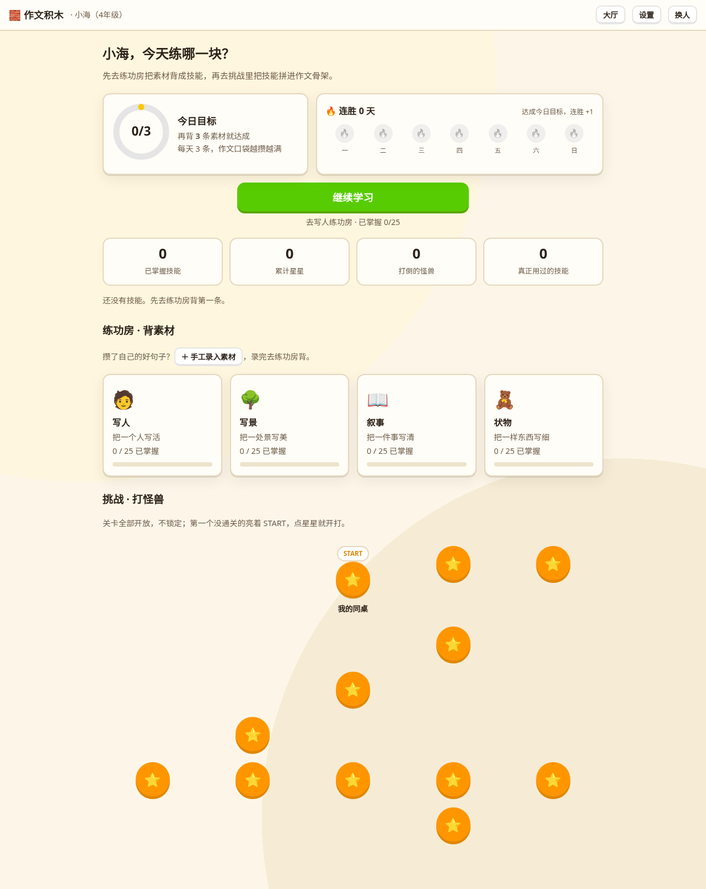
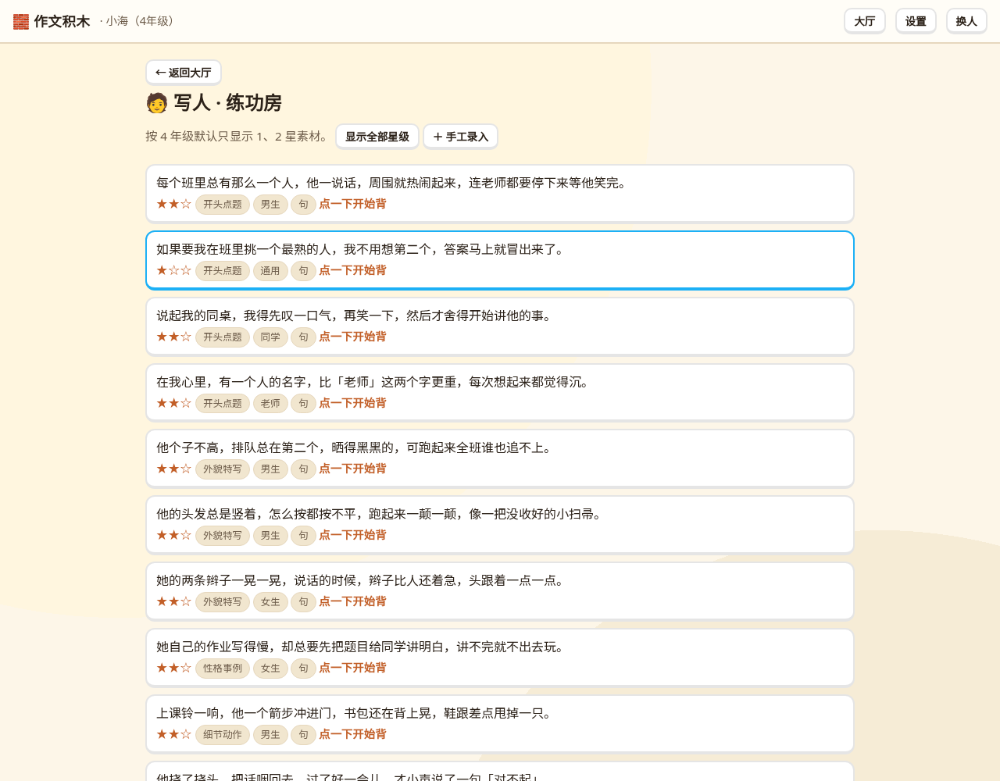
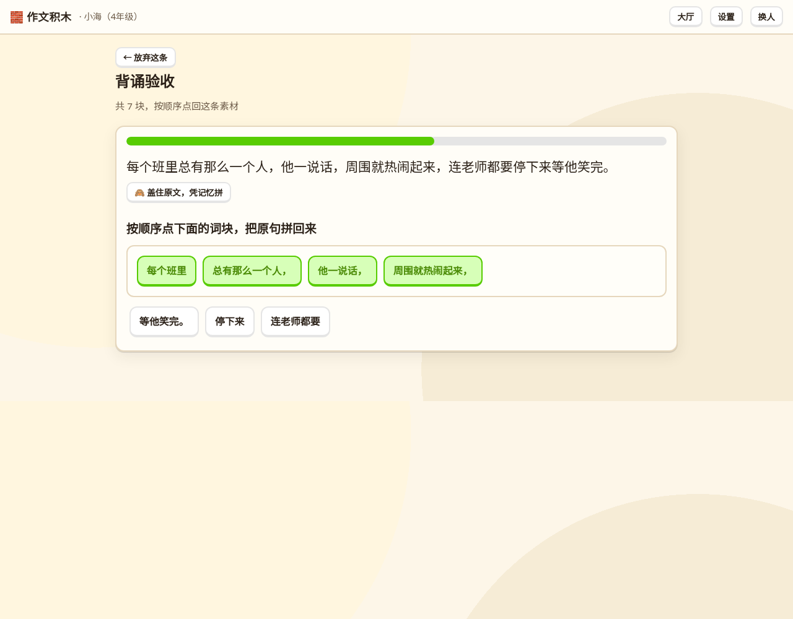
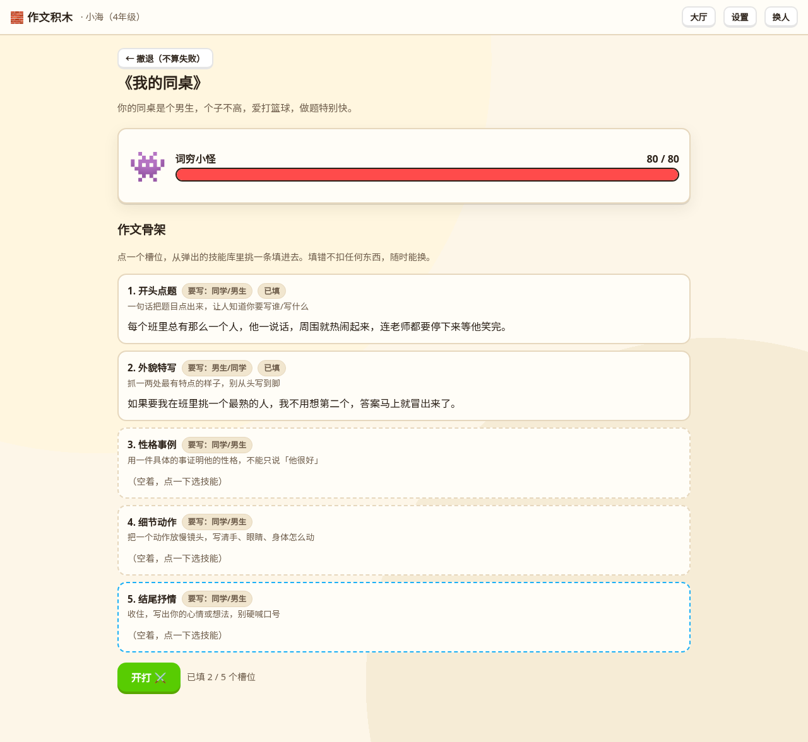

# 作文积木 🧱

面向小学 4-6 年级的作文训练网页应用：先背诵通用素材，通过验收后素材转为「技能」；面对具体作文题目时，把技能拼进作文骨架打怪兽。训练的是**选材与拼装**能力，不是从零创作。

## 产品一览

| 大厅：日目标 / 连胜 / 挑战小径 | 练功房：按星级背素材 |
|:---:|:---:|
|  |  |

| 背诵验收：词语级拼接 | 挑战：把技能拼进作文骨架 |
|:---:|:---:|
|  |  |

## 玩法循环

1. **背**：练功房里按年级推荐星级挑素材，打乱的词块按顺序点回去，全对才算背会，素材转为技能入库。
2. **拼**：挑战里面对具体题目，点开骨架槽位，从自己的技能库里挑句子填进去——只做选择与排布，不自己写句子。
3. **打**：本地规则立即判定每条技能的契合度并结算伤害，AI 在后面补一段更具体的点评；漏用、误用都会被点出来。

## 快速开始

零依赖，Node 18+：

```bash
ZWJM_KEY=你的模型Key node server.js    # 缺 Key 也能跑，只是没有 AI 点评
# 打开 http://127.0.0.1:8080
```

进度只存在浏览器 localStorage，一台电脑多个档案，无账号。环境变量（`ZWJM_BASE` / `ZWJM_MODEL` / `PORT` / `ZWJM_PREFIX` / `ZWJM_UPSTREAM`）见 [server.js](server.js) 头注释。

## 架构速览

| 文件 | 职责 |
|---|---|
| `corpus.js` | 素材库：100 条素材 + 人工标注词块 |
| `quests.js` | 4 大题材、12 道题目及其作文骨架（槽位） |
| `app.js` | 档案、练功房、背诵验收 |
| `battle.js` | 挑战：拼搭、规则判定、AI 点评 |
| `sfx.js` | Web Audio 现场合成音效，零音频文件 |
| `server.js` | 静态托管 + AI 代理：模型 Key 只留在服务器 |

判定以本地规则为唯一权威，AI 只是把结论讲得更像人话，拿不到也不影响打怪。

## 更多文档

- [CONTEXT.md](CONTEXT.md) — 术语表（素材 / 技能 / 槽位 / 契合度……）
- [docs/adr/](docs/adr/) — 架构决策记录（骨架槽位优先、规则先行 AI 增强、服务端 AI 代理）
